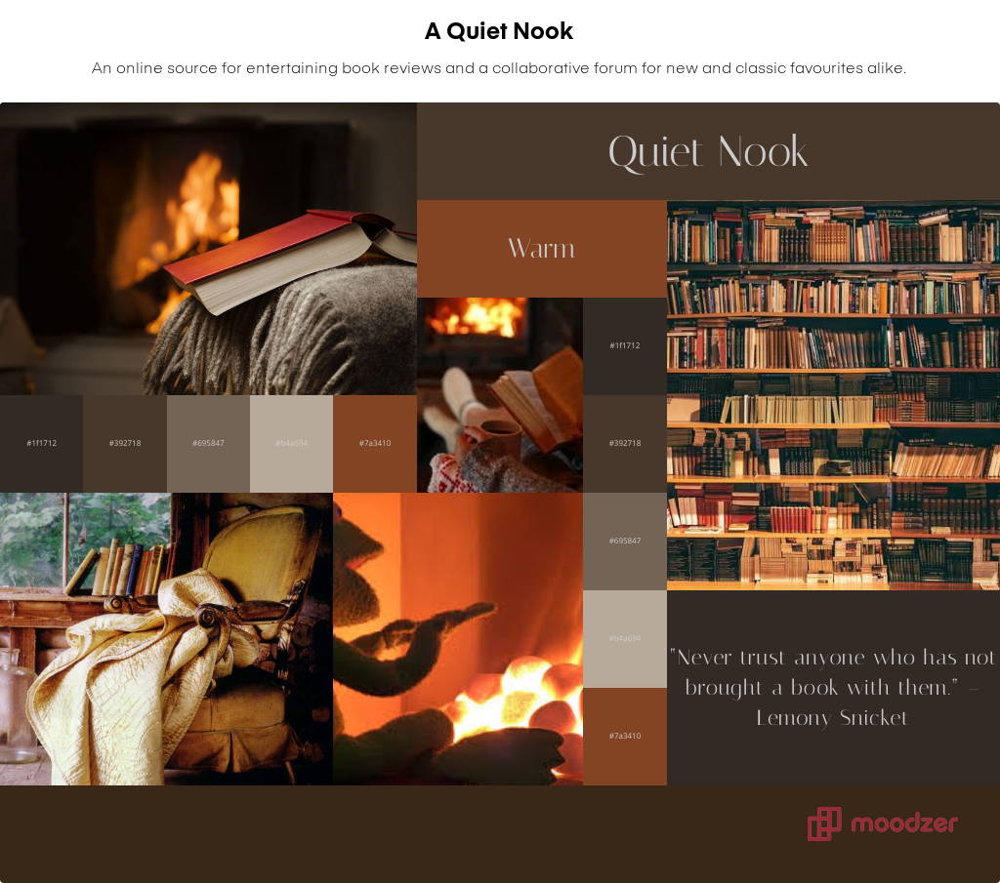

# A Quiet Nook Mood Board

A Quiet Nook is a small online book review site that feels like a second home to those that visit. The site's main inspiration draws from the feeling of comfort and safety that comes from spending a rainy winter day locked indoors snuggled up by a fireplace and going on an adventure with an old book. The following picture was chosen as the initial backboard for the subsequent design process.

## The Mood Board

'Warm', 'cosy', 'quiet' and 'soft' are some words that attempt to capture the feel of this product. The font choices for the board should be an easy to read and comfortable style not taxing on the user and the main logo/headings font will emulate the feel of the site (Quiet, soft, etc.).

